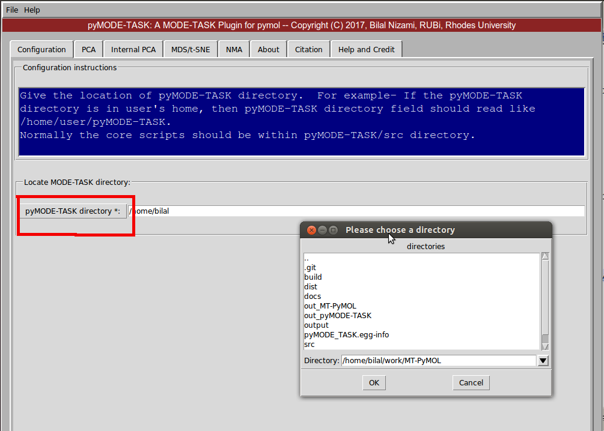
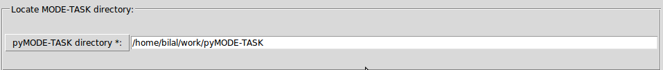
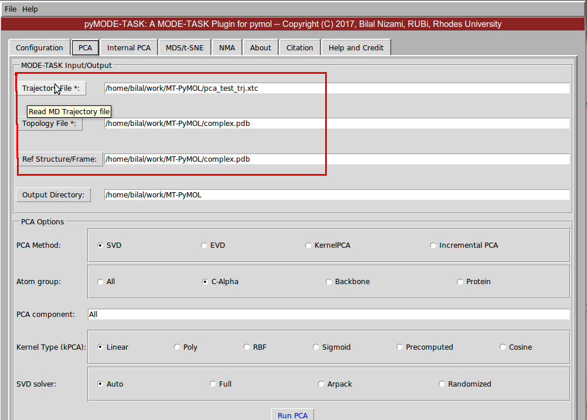
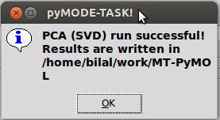
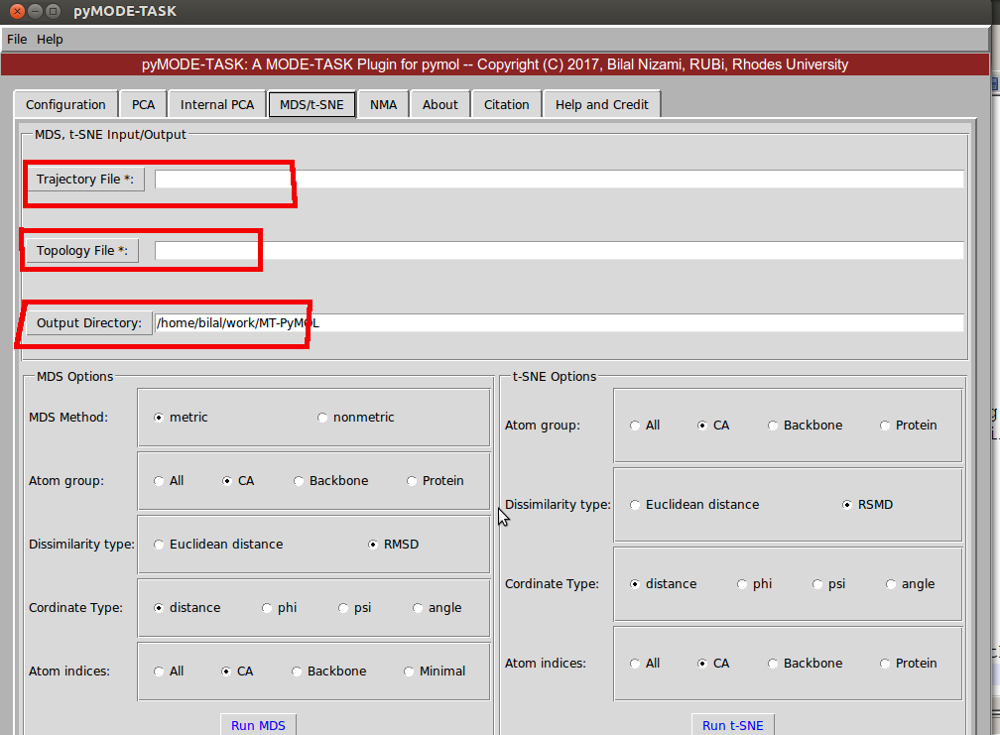

pyMODE-TASK usage
====================================

pyMODE-TASK is a pymol plugin and GUI for command line based MODE-TASK tool. It include all the functionality
of the MODE-TASK. 

PCA of a MD trajectory
-------------------------------

**1. Preparation of trajectory**

Prepare the MD trajectory as described in the tutorial section of MODE-TASK. It involves removing waters and 
periodicity if any. 

**2. PCA**

1. Start the plugin from pymol, plugin --> pyMODE-TASK.
2. Locate the pyMODE-TASK directory in the configuration tab by clicking on button "pyMODE-TASK directory". 
Browse to the directory and click ok.

   Fig: Set pyMODE-TASK directory
   
3. It should look something like this

   Fig: Set pyMODE-TASK directory
	
4. Next go to the PCA tab. Read the trajectory, topology and reference PDB by clicking on the respective
buttons. Next select the appropriate options and click on Run PCA. The results file will be saved in a folder
within the output directory. 

   Fig: PCA 
   
5. If the run is successful you will see something like following

   Fig: PCA successful 
   
MDS and t-SNE
-------------------------------

1. Read the trajectory, topology files by clicking on the respective buttons. Select the appropriate options 
under MDS options widget and click on Run MDS.

2. Similarly, run the t-SNE.

   Fig: MDS and t-SNE 
   
   
Normal mode analysis (NMA)
-------------------------------
